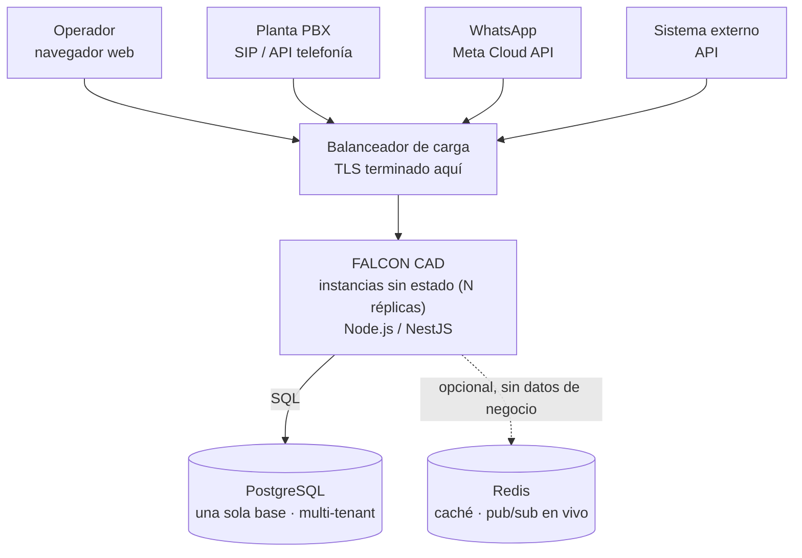
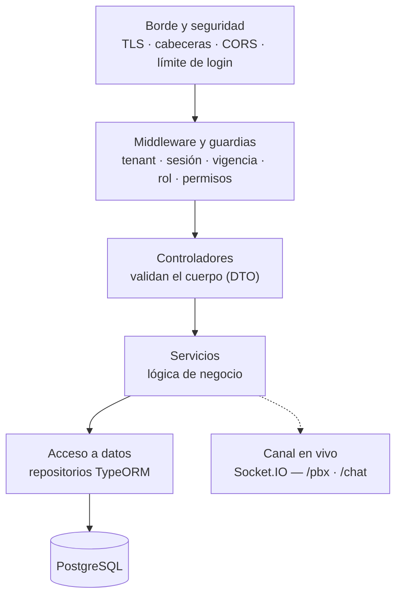
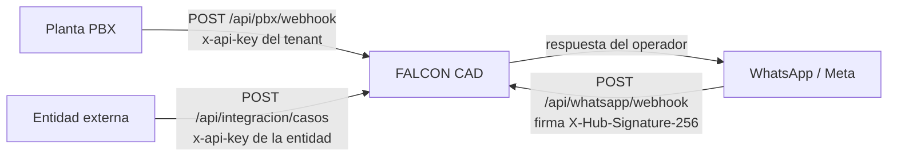

# FALCON CAD

**FALCON CAD** es la plataforma tecnológica nacional para la gestión integral de
emergencias, diseñada para recibir, clasificar, coordinar y hacer seguimiento a
las llamadas al **123**. Centraliza la información operativa en tiempo real,
facilita la interoperabilidad entre las entidades de respuesta y optimiza la toma
de decisiones para brindar una atención más rápida, eficiente y segura a la
ciudadanía.

Recepción de incidentes **multicanal** (llamada / chat / integración), gestión de
casos **multi-agencia** y arquitectura **multi-inquilino**: todos los municipios
comparten el mismo backend y la misma base de datos, aislados por una columna
`tenant` — no hay una instancia de infraestructura por municipio.

## Estructura

```
secad-lite/
├─ frontend/   Angular 20 (standalone) — UI (tema teal)
├─ backend/    NestJS 10 — API: auth, casos (recepción), chat, métricas, administración
│  └─ Dockerfile   imagen multi-stage, sin estado propio, lista para cualquier orquestador
└─ loadtest/   herramienta de prueba de carga (varios tenants + operadores simulados)
```

## Arquitectura

Un **monolito modular**: un solo proceso, organizado internamente por dominio, sin
llamadas de red entre sus propias partes. No guarda estado propio — todo vive en
PostgreSQL — así que corre en cualquier número de réplicas idénticas detrás de un
balanceador de carga, sin coordinación adicional entre ellas.



Dentro de cada instancia, toda petición pasa por las mismas capas en el mismo
orden antes de tocar la base de datos:



El aislamiento entre tenants es responsabilidad de la **aplicación** (cada
consulta filtra por `tenant`), no de PostgreSQL — hoy no hay Row-Level Security
activo a nivel de motor.

## Requisitos

- Node.js 20+ y npm.
- PostgreSQL 14+ (o Docker, ver abajo).

## Cómo correrlo (desarrollo)

**0) Base de datos** — con Docker:
```bash
docker compose up -d      # PostgreSQL en localhost:5433 (postgres/postgres/secad_lite)
```
O usa tu propio PostgreSQL y ajusta `DATABASE_URL` en `backend/.env`.

**1) Backend** (puerto 3000):
```bash
cd backend
cp .env.example .env      # DATABASE_URL, JWT_SECRET, etc.
                          # Windows PowerShell: Copy-Item .env.example .env
npm install
npm run start             # http://localhost:3000/api  ·  health: /api/health
```
> Si al arrancar dice `Falta DATABASE_URL`, es que no creaste el `.env` (paso de
> arriba).

El esquema se crea solo al arrancar (TypeORM `synchronize`, solo dev) y se
siembran datos de demo para el tenant `demo`.

**2) Frontend** (puerto 4200):
```bash
cd frontend
npm install
npm start                 # http://localhost:4200
```

**Credenciales de demo** (pestaña *Usuario*, contraseña `demo`):
`superadmin` (global) · `admin1` · `supervisor1` · `operador1` (tenant `demo`).
Pestaña *Ciudadano*: cualquier correo con contraseña `demo`.

## Qué incluye

- **Login** de usuarios (username único global; el tenant se deduce del usuario)
  + acceso *Ciudadano* aparte para el chat.
- **Administración**: un **superadmin** global crea **tenants** (instancias) y sus
  usuarios; cada **admin de tenant** gestiona solo los usuarios de su tenant. Cada
  usuario queda asociado a un tenant.
- **Recepción**: bandeja de casos **multicanal** (llamada / chat / integración),
  crear caso, cambiar estado y **derivar a otra agencia** (multi-agencia).
- **Despacho** (núcleo CAD): flota de **recursos/unidades** con disponibilidad,
  **asignación** a un caso y ciclo **asignado → en ruta → en sitio →
  finalizada/cancelada**, con el recurso y el caso (`despachado`) sincronizados y
  cada paso en la bitácora.
- **Detalle de caso** con **bitácora de auditoría** (línea de tiempo inmutable):
  creación, cambios de estado, derivaciones y notas, cada evento con autor y fecha.
- **Persistencia** en **PostgreSQL pooled** (TypeORM): una sola base aislada por
  columna `tenant`; toda consulta filtra por tenant. Verificado: un token de otro
  tenant ve 0 casos ajenos.
- **JWT firmados** (`@nestjs/jwt`): guard global obliga token en todas las rutas
  salvo login y health. El `tenant` viaja en el token, no se puede falsear por
  header.
- **Roles y permisos dinámicos (RBAC)**: catálogo fijo de permisos verificados
  en código (`@Permisos` + guard) y **roles por tenant** editables desde la
  **matriz de permisos** en Administración (crear roles a medida, marcar qué
  puede hacer cada uno); `superadmin` y `ciudadano` son reservados. Los permisos
  se emiten en el JWT al iniciar sesión.
- **Chat en vivo** (Socket.IO): el ciudadano abre un chat que crea un caso y
  conversa con el operador en tiempo real.
- **Panel de gestión**: métricas de casos por estado, canal y agencia.
- **Integración con planta telefónica (PBX)**: la central llama a un **webhook**
  (`POST /api/pbx/webhook`) autenticado con la **API key del tenant** (header
  `x-api-key`); las llamadas entran a una **cola en vivo** (Socket.IO, namespace
  `/pbx`) y el operador las **atiende** con *screen-pop* (crea o enlaza el caso
  con el teléfono del llamante). El admin del tenant ve/rota su API key y la URL
  del webhook en **Administración**.
- **Integración con WhatsApp (Cloud API de Meta)**: la central de WhatsApp llama
  a un **webhook** (`GET` verificación · `POST` mensajes); cada mensaje **crea o
  continúa** un caso (canal `whatsapp`) del mismo número con su conversación, y
  el operador **responde** desde el detalle (se envía a Meta con el token del
  tenant). Configurable en **Administración**.
- **API entrante para entidades externas**: entidades registradas (alarmas
  monitoreadas, otras centrales, apps municipales) **radican casos** por API REST
  con su propia **API key** (`ek_…`, revocable/rotable por entidad) y consultan
  el estado **solo de sus casos**. Gestión en **Administración**.
- **Tema e identidad propios** (teal).

> Referencia técnica completa (URL, headers, autenticación, cuerpo y
> respuesta de cada endpoint) de las tres integraciones anteriores:
> [`docs/integraciones-externas.md`](docs/integraciones-externas.md).

FALCON recibe eventos de sistemas externos por esos tres canales, cada uno con
su propia credencial — ninguno depende de la sesión institucional:



## Integración con WhatsApp (Cloud API de Meta)

Se registra una app de Meta apuntando el webhook a FALCON CAD; el
`phone_number_id` del número enruta cada mensaje al tenant:

```
GET  /api/whatsapp/webhook   # verificación de Meta (hub.verify_token = WHATSAPP_VERIFY_TOKEN)
POST /api/whatsapp/webhook   # mensajes entrantes (payload Cloud API); crea/continúa el caso
```

El operador atiende el caso `whatsapp` desde su detalle: ve la conversación y
**responde** (`POST /api/whatsapp/casos/:id/responder`), que guarda el mensaje y
lo envía por la Graph API con el token del tenant. El `phone_number_id`, el token
y el *verify token* se configuran en **Administración** (rol admin) ·
`GET/PUT /api/whatsapp/config`.

## Integración con la planta telefónica (PBX)

La central telefónica notifica a FALCON CAD por webhook:

```
POST /api/pbx/webhook        Header: x-api-key: <API key del tenant>
# al timbrar
{ "evento": "entrante", "numero": "3001234567", "callId": "abc-123", "numeroDestino": "123" }
# al colgar (perdida si no se atendió, finalizada si sí)
{ "evento": "colgada", "callId": "abc-123" }
```

Los funcionarios ven la cola en **Llamadas** (badge de timbrado en la barra) y
al **Atender** saltan al caso. La API key se obtiene/rota en **Administración**
(rol admin) o vía `GET /api/pbx/config` · `POST /api/pbx/config/rotar`.

### Enrutamiento por extensión (ACD)

Quién decide a qué operador dirigir cada llamada es la central telefónica, no
FALCON CAD: si tiene colas ACD (Asterisk/FreePBX o un proveedor con esa
capacidad), ya sabe qué agente está libre y a qué extensión mandarla. FALCON
CAD solo necesita el mapeo extensión → funcionario para traducir eso a "avisar
solo a esta sesión":

1. En **Administración → Usuarios**, asígnele a cada funcionario su extensión
   (única por secad).
2. La central manda la extensión en el evento `entrante`:

   ```
   { "evento": "entrante", "numero": "3001234567", "extension": "105" }
   ```

3. Si la extensión coincide con un funcionario activo, el aviso llega **solo**
   a su sesión (Socket.IO, sala personal) y esa llamada desaparece de la cola
   de los demás operadores — igual que un teléfono de escritorio real no suena
   en el puesto de al lado. Un supervisor (`casos.ver_todos`) sigue viendo y
   pudiendo atender cualquier llamada, dirigida o no, para poder auxiliar.

Sin el campo `extension` (o si no hay match), la llamada se anuncia a todo el
que esté atendiendo el tenant — el comportamiento de siempre. La integración
funciona igual con una central sin ACD; el enrutamiento por extensión es
estrictamente adicional.

## API entrante (entidades externas)

Una entidad externa (central de alarmas, otra agencia, una app municipal) se
registra en **Administración → Entidades externas**, eligiendo su **agencia
responsable y canales** del catálogo operativo (igual que en Recepción) y
recibe una **API key propia** (`ek_…`). Con ella radica casos y consulta su
estado:

```
POST /api/integracion/casos      Header: x-api-key: <API key de la entidad>
{ "titulo": "Alarma activada sede norte", "descripcion": "Sensor de humo",
  "referencia": "ACME-77", "telefono": "3001112233",
  "lat": 4.65, "lng": -74.05 }
# → { "casoId": "…", "estado": "nuevo", ... }

GET  /api/integracion/casos/:id  Header: x-api-key: <API key de la entidad>
# → estado actual; solo casos radicados por esa entidad (404 en otro caso)
```

El caso entra a la bandeja con canal `integracion`, autor `entidad:<nombre>` y
la referencia externa en la descripción. **Los canales de atención elegidos al
registrar la entidad son los que llegan a la bandeja de despacho** — sin
ellos, el caso solo lo ve un supervisor (`casos.ver_todos`), nunca un operador
de canal normal. Cada key se **rota o desactiva** por entidad sin afectar a
las demás (permiso `entidades.gestionar`).

La API key identifica a la vez el tenant y la entidad: quien la use nunca
declara "a qué tenant pertenezco", eso lo resuelve el servidor. Es el modelo
estándar para integraciones servidor-a-servidor (sin persona detrás
tecleando una contraseña); la clave debe vivir en el backend de la entidad,
nunca embebida en una app móvil. Además de la API key propia de la entidad,
el servidor valida que el tenant tenga la suscripción vigente y la
integración `api` contratada — un tenant bloqueado o vencido deja de aceptar
casos externos de inmediato, aunque la API key siga siendo válida.

## Migraciones (producción)

En dev, `DB_SYNC=true` crea/actualiza el esquema al arrancar. En producción se
usan **migraciones versionadas** (`backend/src/migrations`):

```bash
cd backend
# generar una migración a partir de cambios en las entidades
npm run migration:generate -- src/migrations/NombreDelCambio
# aplicar / revertir manualmente
npm run migration:run
npm run migration:revert
```

Para que la app aplique las migraciones sola al arrancar, en `.env`:
`DB_SYNC=false` y `DB_MIGRATE=true`.

## Publicarlo

Para una demostración en internet —base en Supabase, API en Render, interfaz en
Vercel— siga [`docs/despliegue-demo.md`](docs/despliegue-demo.md): lleva el
orden de los pasos, las variables de entorno de cada servicio y los límites de
los planes gratuitos. Los detalles de la parte de Vercel están en
[`docs/despliegue-vercel.md`](docs/despliegue-vercel.md).

## Producción y escalamiento

El backend se empaqueta como una **imagen Docker** multi-stage
(`backend/Dockerfile`) — sin estado propio, corre igual con una instancia o con
varias, en cualquier orquestador (Kubernetes, ECS, o el mismo Render).

Con **más de una instancia** corriendo a la vez hace falta `REDIS_URL` (ver
`docs/despliegue-demo.md`, sección 8): sin ella, el aviso en vivo (Socket.IO) y
el límite de intentos de login viven en la memoria de cada instancia por
separado — correcto con una sola instancia, no con varias.

Antes de comprometer un tamaño de plan/instancia en producción, valide la
capacidad real con la herramienta de prueba de carga del repositorio
(`loadtest/`): aprovisiona tenants de prueba, conecta operadores simulados por
el canal en vivo, y genera casos y llamadas a un ritmo configurable, midiendo
latencia y errores. Ver [`loadtest/README.md`](loadtest/README.md).

## Pendiente / a endurecer

- Contraseñas **demo** para los usuarios sembrados → en producción se crean con
  contraseñas reales desde el módulo de administración.
- Integración real con el flujo de llamadas al **123** y con las entidades de
  respuesta (interoperabilidad).
- **Row-Level Security de Postgres**: el aislamiento entre tenants hoy es solo
  de aplicación (columna `tenant` filtrada en cada consulta) — RLS agregaría
  una segunda capa de defensa a nivel de motor, independiente de un bug en el
  backend.
- **Retención de la bitácora**: `casos_eventos` y `admin_bitacora` son de solo
  escritura, sin purga ni archivado por antigüedad — crecen indefinidamente.
- **Validación real del certificado TLS** contra la base de datos
  (`DB_SSL_CA`) — sin ella, `DB_SSL=true` cifra pero no valida la cadena.
